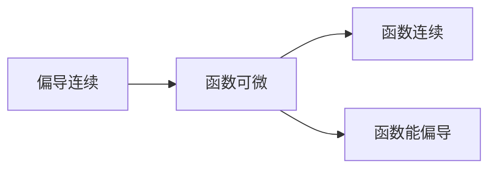

考前复习总结——微积分A2篇。

<!-- more -->

新渲染环境的Latex有一点缺陷，一些复杂Latex不能正常显示。如果想知道到底是啥样，可以自己复制走渲染一下（）。

## 偏导数

### 多元复合函数偏导数 

对于$F = u(x) + v(x) + w(x)$，有：
$$
\frac {\partial F} {\partial x} = \frac {\partial F} {\partial u}·\frac {\partial u} {\partial x}+\frac {\partial F} {\partial v}·\frac {\partial v} {\partial x}+\frac {\partial F} {\partial w}·\frac {\partial w} {\partial x}
$$
以此类推。

注意：偏导数符号$\partial$只能对多元函数使用，若对应函数是单元函数，则应该使用微分符号$d$。

### 多元隐函数的偏导数

若隐函数$F = f(x, y, z)$，其中 z 是关于 x, y 的函数，则：
$$
\frac {\partial z} {\partial x} = -\frac {\frac {\partial F} {\partial x}} {\frac {\partial F} {\partial z}}
$$
对于 y 的偏导数也类似，约分后其实是一样的。

### 方向导数

若函数f(x, y)在点P(x0, y0)可微分，那么函数在该点任意方向l的方向导数存在且有：
$$
\frac{\partial f}{\partial l}|_{(x_0,y_0)}=f'_x(x_0,y_0)cos\alpha+f'_y(x_0,y_0)cos\beta
$$

### 梯度

<math xmlns="http://www.w3.org/1998/Math/MathML" display="block"><mo>令</mo><mi>g</mi><mi>r</mi><mi>a</mi><mi>d</mi><mtext>&nbsp;</mtext><mi>f</mi><mo stretchy="false">(</mo><msub><mi>x</mi><mn>0</mn></msub><mo>,</mo><msub><mi>y</mi><mn>0</mn></msub><mo stretchy="false">)</mo><mo>=</mo><mi mathvariant="normal">∇</mi><mi>f</mi><mo stretchy="false">(</mo><msub><mi>x</mi><mn>0</mn></msub><mo>,</mo><msub><mi>y</mi><mn>0</mn></msub><mo stretchy="false">)</mo><mo>=</mo><msubsup><mi>f</mi><mi>x</mi><mo>′</mo></msubsup><mo stretchy="false">(</mo><msub><mi>x</mi><mn>0</mn></msub><mo>,</mo><msub><mi>y</mi><mn>0</mn></msub><mo stretchy="false">)</mo><mi>i</mi><mo>+</mo><msubsup><mi>f</mi><mi>y</mi><mo>′</mo></msubsup><mo stretchy="false">(</mo><msub><mi>x</mi><mn>0</mn></msub><mo>,</mo><msub><mi>y</mi><mn>0</mn></msub><mo stretchy="false">)</mo><mi>j</mi><mspace linebreak="newline"></mspace><mi mathvariant="normal">∇</mi><mo>=</mo><mfrac><mi mathvariant="normal">∂</mi><mrow><mi mathvariant="normal">∂</mi><mi>x</mi></mrow></mfrac><mi>i</mi><mo>+</mo><mfrac><mi mathvariant="normal">∂</mi><mrow><mi mathvariant="normal">∂</mi><mi>y</mi></mrow></mfrac><mi>j</mi><mspace linebreak="newline"></mspace><mo>若函数</mo><mi>f</mi><mo stretchy="false">(</mo><mi>x</mi><mo>,</mo><mi>y</mi><mo stretchy="false">)</mo><mo>在点</mo><mi>P</mi><mo stretchy="false">(</mo><msub><mi>x</mi><mn>0</mn></msub><mo>,</mo><msub><mi>y</mi><mn>0</mn></msub><mo stretchy="false">)</mo><mo>可微分，</mo><msub><mi>e</mi><mi>l</mi></msub><mo>=</mo><mo stretchy="false">(</mo><mi>c</mi><mi>o</mi><mi>s</mi><mi>α</mi><mo>,</mo><mi>c</mi><mi>o</mi><mi>s</mi><mi>β</mi><mo stretchy="false">)</mo><mo>是与</mo><mi>l</mi><mo>同向的单位向量</mo><mspace linebreak="newline"></mspace><mo>则:</mo><mtable displaystyle="true" columnalign="right left right left right left right left right left right left" columnspacing="0em 2em 0em 2em 0em 2em 0em 2em 0em 2em 0em" rowspacing="3pt"><mtr><mtd><mfrac><mrow><mi mathvariant="normal">∂</mi><mi>f</mi></mrow><mrow><mi mathvariant="normal">∂</mi><mi>l</mi></mrow></mfrac><msub><mo stretchy="false">|</mo><mrow><mo stretchy="false">(</mo><msub><mi>x</mi><mn>0</mn></msub><mo>,</mo><msub><mi>y</mi><mn>0</mn></msub><mo stretchy="false">)</mo></mrow></msub></mtd><mtd><mi></mi><mo>=</mo><msubsup><mi>f</mi><mi>x</mi><mo>′</mo></msubsup><mo stretchy="false">(</mo><msub><mi>x</mi><mn>0</mn></msub><mo>,</mo><msub><mi>y</mi><mn>0</mn></msub><mo stretchy="false">)</mo><mi>c</mi><mi>o</mi><mi>s</mi><mi>α</mi><mo>+</mo><msubsup><mi>f</mi><mi>y</mi><mo>′</mo></msubsup><mo stretchy="false">(</mo><msub><mi>x</mi><mn>0</mn></msub><mo>,</mo><msub><mi>y</mi><mn>0</mn></msub><mo stretchy="false">)</mo><mi>c</mi><mi>o</mi><mi>s</mi><mi>β</mi></mtd></mtr><mtr><mtd></mtd><mtd><mi></mi><mo>=</mo><mi>g</mi><mi>r</mi><mi>a</mi><mi>d</mi><mtext>&nbsp;</mtext><mi>f</mi><mo stretchy="false">(</mo><msub><mi>x</mi><mn>0</mn></msub><mo>,</mo><msub><mi>y</mi><mn>0</mn></msub><mo stretchy="false">)</mo><mo>⋅</mo><msub><mi>e</mi><mi>l</mi></msub></mtd></mtr><mtr><mtd></mtd><mtd><mi></mi><mo>=</mo><mrow><mo stretchy="false">|</mo></mrow><mi>g</mi><mi>r</mi><mi>a</mi><mi>d</mi><mtext>&nbsp;</mtext><mi>f</mi><mo stretchy="false">(</mo><msub><mi>x</mi><mn>0</mn></msub><mo>,</mo><msub><mi>y</mi><mn>0</mn></msub><mo stretchy="false">)</mo><mrow><mo stretchy="false">|</mo></mrow><mi>c</mi><mi>o</mi><mi>s</mi><mi>θ</mi></mtd></mtr><mtr><mtd><mo>其中</mo><mi>θ</mi><mo>=</mo><mrow><mover><mrow><mi>g</mi><mi>r</mi><mi>a</mi><mi>d</mi><mtext>&nbsp;</mtext><mo stretchy="false">(</mo><mi>f</mi><mo stretchy="false">(</mo><msub><mi>x</mi><mn>0</mn></msub><mo>,</mo><msub><mi>y</mi><mn>0</mn></msub><mo stretchy="false">)</mo><mo>,</mo><mtext>&nbsp;</mtext><msub><mi>e</mi><mi>l</mi></msub><mo stretchy="false">)</mo></mrow><mo>^</mo></mover></mrow></mtd></mtr></mtable></math>

### 一些性质

成员相同，则结果相同，与路径无关。
$$
\frac {\partial^2 Z} {\partial x \partial y} = \frac {\partial^2 Z} {\partial y \partial x}
$$

## 全微分

### 多元函数的全微分

$$
dZ=\frac {\partial Z} {\partial x}dx + \frac {\partial Z} {\partial y}dy+...
$$

### 由全微分求未知参数

先把全微分中的$\frac {\partial Z} {\partial x}$对应到具体的表达式，然后对另外一个变量求偏导。因为成员相同则结果相同，得到方程。求解即可。

### 多元函数求极值

1. 求出满足$\frac {\partial z} {\partial x} = 0$和$\frac {\partial z} {\partial y} = 0$的解$(x, y)$。

2. 令$ A = \frac {\partial^2 z}{\partial x^2},B=\frac {\partial^2 z}{\partial x\partial y}, C=\frac {\partial^2 z}{\partial y^2} $，将第一步的解代入，求出A, B, C。

3. 求$B^2-AC$的值，有：
<math xmlns="http://www.w3.org/1998/Math/MathML" display="block"><msup><mi>B</mi><mn>2</mn></msup><mo>−</mo><mi>A</mi><mi>C</mi><mrow data-mjx-texclass="INNER"><mo data-mjx-texclass="OPEN">{</mo><mtable columnalign="left right" columnspacing="1em" rowspacing="4pt"><mtr><mtd><mo>&lt;</mo><mn>0</mn><mo>,</mo><mi>A</mi><mo>&lt;</mo><mn>0</mn></mtd><mtd><mo>极大值</mo></mtd></mtr><mtr><mtd><mo>&lt;</mo><mn>0</mn><mo>,</mo><mi>A</mi><mo>&gt;</mo><mn>0</mn></mtd><mtd><mo>极小值</mo></mtd></mtr><mtr><mtd><mo>=</mo><mn>0</mn></mtd><mtd><mo>不确定</mo></mtd></mtr><mtr><mtd><mo>&gt;</mo><mn>0</mn></mtd><mtd><mo>不是极值点</mo></mtd></mtr></mtable><mo data-mjx-texclass="CLOSE" fence="true" stretchy="true" symmetric="true"></mo></mrow></math>

4. 极值为函数在(x, y)的值。

### 多元隐函数求极值

与上述步骤相似，第一步中的方程组加上原方程。

### 多元函数求最值

1. 求出偏导=0的解。
2. 找出定义域的边界。
3. 将解和边界都带入原函数，求出结果。
4. (对于式子，取最大值和最小值。)
5. 取这些函数值的最值。

### 一些知识点

1. 如果一个多元函数的偏导在某一点连续，那么该函数在改点可微。
2. 如果一个多元函数在某一点可微，则这个函数在该点连续。
3. 如果一个多元函数在某一点可微，则这个函数在该店有偏导。
4. 连续与偏导无关。

## 空间向量

### 向量长度

$$
|\vec a|=\sqrt {a^2_1+a^2_2+...}
$$

### 向量点乘

$$
\begin{equation}
\begin{aligned}
	\vec a\cdot\vec b
	&=(x_1,y_1,z_1)\cdot(x_2,y_2,z_2)\\
	&=x_1x_2+y_1y_2+z_1z_2
\end{aligned}
\end{equation}
$$

### 向量叉乘

<math xmlns="http://www.w3.org/1998/Math/MathML" display="block"><mtable displaystyle="true" columnalign="right left right left right left right left right left right left" columnspacing="0em 2em 0em 2em 0em 2em 0em 2em 0em 2em 0em" rowspacing="3pt"><mtr><mtd><mrow><mover><mi>a</mi><mo stretchy="false">→</mo></mover></mrow><mo>×</mo><mrow><mover><mi>b</mi><mo stretchy="false">→</mo></mover></mrow></mtd><mtd><mi></mi><mo>=</mo><mo stretchy="false">(</mo><msub><mi>a</mi><mn>1</mn></msub><mo>,</mo><msub><mi>a</mi><mn>2</mn></msub><mo>,</mo><msub><mi>a</mi><mn>3</mn></msub><mo stretchy="false">)</mo><mo>×</mo><mo stretchy="false">(</mo><msub><mi>b</mi><mn>1</mn></msub><mo>,</mo><msub><mi>b</mi><mn>2</mn></msub><mo>,</mo><msub><mi>b</mi><mn>3</mn></msub><mo stretchy="false">)</mo></mtd></mtr><mtr><mtd></mtd><mtd><mi></mi><mo>=</mo><mrow data-mjx-texclass="INNER"><mo data-mjx-texclass="OPEN">|</mo><mtable columnalign="" columnspacing="1em" rowspacing="4pt"><mtr><mtd><mrow><mover><mi>i</mi><mo stretchy="false">→</mo></mover></mrow></mtd><mtd><mrow><mover><mi>j</mi><mo stretchy="false">→</mo></mover></mrow></mtd><mtd><mrow><mover><mi>k</mi><mo stretchy="false">→</mo></mover></mrow></mtd></mtr><mtr><mtd><msub><mi>a</mi><mn>1</mn></msub></mtd><mtd><msub><mi>a</mi><mn>2</mn></msub></mtd><mtd><msub><mi>a</mi><mn>3</mn></msub></mtd></mtr><mtr><mtd><msub><mi>b</mi><mn>1</mn></msub></mtd><mtd><msub><mi>b</mi><mn>2</mn></msub></mtd><mtd><msub><mi>b</mi><mn>3</mn></msub></mtd></mtr></mtable><mo data-mjx-texclass="CLOSE">|</mo></mrow></mtd></mtr><mtr><mtd></mtd><mtd><mi></mi><mo>=</mo><mrow><mover><mi>i</mi><mo stretchy="false">→</mo></mover></mrow><mrow data-mjx-texclass="INNER"><mo data-mjx-texclass="OPEN">|</mo><mtable columnalign="" columnspacing="1em" rowspacing="4pt"><mtr><mtd><msub><mi>a</mi><mn>2</mn></msub></mtd><mtd><msub><mi>a</mi><mn>3</mn></msub></mtd></mtr><mtr><mtd><msub><mi>b</mi><mn>2</mn></msub></mtd><mtd><msub><mi>b</mi><mn>3</mn></msub></mtd></mtr></mtable><mo data-mjx-texclass="CLOSE">|</mo></mrow><mo>+</mo><mrow><mover><mi>j</mi><mo stretchy="false">→</mo></mover></mrow><mrow data-mjx-texclass="INNER"><mo data-mjx-texclass="OPEN">|</mo><mtable columnalign="" columnspacing="1em" rowspacing="4pt"><mtr><mtd><msub><mi>a</mi><mn>1</mn></msub></mtd><mtd><msub><mi>a</mi><mn>3</mn></msub></mtd></mtr><mtr><mtd><msub><mi>b</mi><mn>1</mn></msub></mtd><mtd><msub><mi>b</mi><mn>3</mn></msub></mtd></mtr></mtable><mo data-mjx-texclass="CLOSE">|</mo></mrow><mo>+</mo><mrow><mover><mi>k</mi><mo stretchy="false">→</mo></mover></mrow><mrow data-mjx-texclass="INNER"><mo data-mjx-texclass="OPEN">|</mo><mtable columnalign="" columnspacing="1em" rowspacing="4pt"><mtr><mtd><msub><mi>a</mi><mn>1</mn></msub></mtd><mtd><msub><mi>a</mi><mn>2</mn></msub></mtd></mtr><mtr><mtd><msub><mi>b</mi><mn>1</mn></msub></mtd><mtd><msub><mi>b</mi><mn>2</mn></msub></mtd></mtr></mtable><mo data-mjx-texclass="CLOSE">|</mo></mrow></mtd></mtr></mtable></math>

### 向量夹角

$$
\vec a\cdot\vec b=|\vec a|\cdot|\vec b|\cdot cos\theta
$$

### 向量投影

$$
|\vec{a_{Projection}}|=\frac {\vec a\cdot\vec b}{|\vec b|} \\
\vec {a_{Projection}}=|\vec{a_{Projection}}|\cdot\frac {\vec b}{|\vec b|}
$$

### 一些结论

- 点乘为0，则向量垂直。
- 叉乘为0，则向量平行。
- 向量各坐标成比例，则向量平行。
- 若 向量a × 向量b = 向量c，则 c 垂直于 a, b 和其所在平面。

## 空间几何

### 表示方法

$$
平面方程：Ax+By+Cz+D=0 \\
对应法向量：\vec n=(A, B, C) \\
$$

<math xmlns="http://www.w3.org/1998/Math/MathML" display="block"><mo>直线</mo><mi>L</mi><mo>经过点</mo><mi>M</mi><mo stretchy="false">(</mo><msub><mi>x</mi><mn>0</mn></msub><mo>,</mo><msub><mi>y</mi><mn>0</mn></msub><mo>,</mo><msub><mi>z</mi><mn>0</mn></msub><mo stretchy="false">)</mo><mo>,</mo><mo>且方向向量为</mo><mrow><mover><mi>s</mi><mo stretchy="false">→</mo></mover></mrow><mo>=</mo><mo stretchy="false">(</mo><mi>l</mi><mo>,</mo><mi>m</mi><mo>,</mo><mi>n</mi><mo stretchy="false">)</mo><mspace linebreak="newline"></mspace><mo>则</mo><mi>L</mi><mo>:</mo><mfrac><mrow><mi>x</mi><mo>−</mo><msub><mi>x</mi><mn>0</mn></msub></mrow><mi>l</mi></mfrac><mo>=</mo><mfrac><mrow><mi>y</mi><mo>−</mo><msub><mi>y</mi><mn>0</mn></msub></mrow><mi>m</mi></mfrac><mo>=</mo><mfrac><mrow><mi>z</mi><mo>−</mo><msub><mi>z</mi><mn>0</mn></msub></mrow><mi>n</mi></mfrac><mspace linebreak="newline"></mspace><mo>两个面联立表示其交线，叫做直线的一般式方程</mo><mspace linebreak="newline"></mspace></math>

### 点到面的距离

$$
d=\frac {|Ax_0+By_0+Cz_0+D|}{\sqrt {A^2+B^2+C^2}}
$$

### 点到线的距离

<math xmlns="http://www.w3.org/1998/Math/MathML" display="block"><mi>d</mi><mo>=</mo><msqrt><mo stretchy="false">(</mo><msub><mi>x</mi><mi>p</mi></msub><mo>−</mo><msub><mi>x</mi><mn>0</mn></msub><msup><mo stretchy="false">)</mo><mn>2</mn></msup><mo>+</mo><mo stretchy="false">(</mo><msub><mi>y</mi><mi>p</mi></msub><mo>−</mo><msub><mi>y</mi><mn>0</mn></msub><msup><mo stretchy="false">)</mo><mn>2</mn></msup><mo>+</mo><mo stretchy="false">(</mo><msub><mi>z</mi><mi>p</mi></msub><mo>−</mo><msub><mi>z</mi><mn>0</mn></msub><msup><mo stretchy="false">)</mo><mn>2</mn></msup></msqrt><mspace linebreak="newline"></mspace><mo>其中，</mo><msub><mi>x</mi><mi>p</mi></msub><mo>、</mo><msub><mi>y</mi><mi>p</mi></msub><mo>、</mo><msub><mi>z</mi><mi>p</mi></msub><mo>为方程组</mo><mrow data-mjx-texclass="INNER"><mo data-mjx-texclass="OPEN">{</mo><mtable columnalign="left left" columnspacing="1em" rowspacing=".2em"><mtr><mtd><mi>l</mi><mo stretchy="false">(</mo><mi>x</mi><mo>−</mo><msub><mi>x</mi><mn>0</mn></msub><mo stretchy="false">)</mo><mo>+</mo><mi>m</mi><mo stretchy="false">(</mo><mi>y</mi><mo>−</mo><msub><mi>y</mi><mn>0</mn></msub><mo stretchy="false">)</mo><mo>+</mo><mi>n</mi><mo stretchy="false">(</mo><mi>z</mi><mo>−</mo><msub><mi>z</mi><mn>0</mn></msub><mo stretchy="false">)</mo></mtd></mtr><mtr><mtd><mo>直线方程</mo></mtd></mtr></mtable><mo data-mjx-texclass="CLOSE" fence="true" stretchy="true" symmetric="true"></mo></mrow><mo>的解</mo></math>

### 曲线在某点处的切线和法平面

<math xmlns="http://www.w3.org/1998/Math/MathML" display="block"><mo>对于曲线</mo><mrow data-mjx-texclass="INNER"><mo data-mjx-texclass="OPEN">{</mo><mtable columnalign="left left" columnspacing="1em" rowspacing=".2em"><mtr><mtd><mi>x</mi><mo>=</mo><mi>x</mi><mo stretchy="false">(</mo><mi>t</mi><mo stretchy="false">)</mo></mtd></mtr><mtr><mtd><mi>y</mi><mo>=</mo><mi>y</mi><mo stretchy="false">(</mo><mi>t</mi><mo stretchy="false">)</mo></mtd></mtr><mtr><mtd><mi>z</mi><mo>=</mo><mi>z</mi><mo stretchy="false">(</mo><mi>t</mi><mo stretchy="false">)</mo></mtd></mtr></mtable><mo data-mjx-texclass="CLOSE" fence="true" stretchy="true" symmetric="true"></mo></mrow><mo>在点</mo><mo stretchy="false">(</mo><mi>x</mi><mo stretchy="false">(</mo><msub><mi>t</mi><mn>0</mn></msub><mo stretchy="false">)</mo><mo>,</mo><mi>y</mi><mo stretchy="false">(</mo><msub><mi>t</mi><mn>0</mn></msub><mo stretchy="false">)</mo><mo>,</mo><mi>z</mi><mo stretchy="false">(</mo><msub><mi>t</mi><mn>0</mn></msub><mo stretchy="false">)</mo><mo stretchy="false">)</mo><mo>的</mo><mspace linebreak="newline"></mspace><mo>切线方程为:</mo><mfrac><mrow><mi>x</mi><mo>−</mo><mi>x</mi><mo stretchy="false">(</mo><msub><mi>t</mi><mn>0</mn></msub><mo stretchy="false">)</mo></mrow><mrow><msup><mi>x</mi><mo>′</mo></msup><mo stretchy="false">(</mo><msub><mi>t</mi><mn>0</mn></msub><mo stretchy="false">)</mo></mrow></mfrac><mo>=</mo><mfrac><mrow><mi>y</mi><mo>−</mo><mi>y</mi><mo stretchy="false">(</mo><msub><mi>t</mi><mn>0</mn></msub><mo stretchy="false">)</mo></mrow><mrow><msup><mi>y</mi><mo>′</mo></msup><mo stretchy="false">(</mo><msub><mi>t</mi><mn>0</mn></msub><mo stretchy="false">)</mo></mrow></mfrac><mo>=</mo><mfrac><mrow><mi>z</mi><mo>−</mo><mi>z</mi><mo stretchy="false">(</mo><msub><mi>t</mi><mn>0</mn></msub><mo stretchy="false">)</mo></mrow><mrow><msup><mi>z</mi><mo>′</mo></msup><mo stretchy="false">(</mo><msub><mi>t</mi><mn>0</mn></msub><mo stretchy="false">)</mo></mrow></mfrac><mspace linebreak="newline"></mspace><mo>法平面方程为:</mo><msup><mi>x</mi><mo>′</mo></msup><mo stretchy="false">(</mo><msub><mi>t</mi><mn>0</mn></msub><mo stretchy="false">)</mo><mo stretchy="false">[</mo><mi>x</mi><mo>−</mo><mi>x</mi><mo stretchy="false">(</mo><msub><mi>t</mi><mn>0</mn></msub><mo stretchy="false">)</mo><mo stretchy="false">]</mo><mo>+</mo><msup><mi>y</mi><mo>′</mo></msup><mo stretchy="false">(</mo><msub><mi>t</mi><mn>0</mn></msub><mo stretchy="false">)</mo><mo stretchy="false">[</mo><mi>y</mi><mo>−</mo><mi>y</mi><mo stretchy="false">(</mo><msub><mi>t</mi><mn>0</mn></msub><mo stretchy="false">)</mo><mo stretchy="false">]</mo><mo>+</mo><msup><mi>z</mi><mo>′</mo></msup><mo stretchy="false">(</mo><msub><mi>t</mi><mn>0</mn></msub><mo stretchy="false">)</mo><mo stretchy="false">[</mo><mi>z</mi><mo>−</mo><mi>z</mi><mo stretchy="false">(</mo><msub><mi>t</mi><mn>0</mn></msub><mo stretchy="false">)</mo><mo stretchy="false">]</mo><mo>=</mo><mn>0</mn><mspace linebreak="newline"></mspace></math>

若不是参数方程形式的曲线，可以把$x'(t)$看作1，把整体对$x$求导得到$y'_x$和$z'_x$,代入上式

### 曲面在某点处得切平面与法线

<math xmlns="http://www.w3.org/1998/Math/MathML" display="block"><mo>在点</mo><mo stretchy="false">(</mo><msub><mi>x</mi><mn>0</mn></msub><mo>,</mo><msub><mi>y</mi><mn>0</mn></msub><mo>,</mo><msub><mi>z</mi><mn>0</mn></msub><mo stretchy="false">)</mo><mo>处的</mo><mspace linebreak="newline"></mspace><mo>切平面方程为:</mo><msubsup><mi>F</mi><mi>x</mi><mo>′</mo></msubsup><mo stretchy="false">(</mo><msub><mi>x</mi><mn>0</mn></msub><mo>,</mo><msub><mi>y</mi><mn>0</mn></msub><mo>,</mo><msub><mi>z</mi><mn>0</mn></msub><mo stretchy="false">)</mo><mo stretchy="false">(</mo><mi>x</mi><mo>−</mo><msub><mi>x</mi><mn>0</mn></msub><mo stretchy="false">)</mo><mo>+</mo><msubsup><mi>F</mi><mi>y</mi><mo>′</mo></msubsup><mo stretchy="false">(</mo><msub><mi>x</mi><mn>0</mn></msub><mo>,</mo><msub><mi>y</mi><mn>0</mn></msub><mo>,</mo><msub><mi>z</mi><mn>0</mn></msub><mo stretchy="false">)</mo><mo stretchy="false">(</mo><mi>y</mi><mo>−</mo><msub><mi>y</mi><mn>0</mn></msub><mo stretchy="false">)</mo><mo>+</mo><msubsup><mi>F</mi><mi>z</mi><mo>′</mo></msubsup><mo stretchy="false">(</mo><msub><mi>x</mi><mn>0</mn></msub><mo>,</mo><msub><mi>y</mi><mn>0</mn></msub><mo>,</mo><msub><mi>z</mi><mn>0</mn></msub><mo stretchy="false">)</mo><mo stretchy="false">(</mo><mi>z</mi><mo>−</mo><msub><mi>z</mi><mn>0</mn></msub><mo stretchy="false">)</mo><mo>=</mo><mn>0</mn><mspace linebreak="newline"></mspace><mo>法线方程为:</mo><mfrac><mrow><mi>x</mi><mo>−</mo><msub><mi>x</mi><mn>0</mn></msub></mrow><mrow><msubsup><mi>F</mi><mi>x</mi><mo>′</mo></msubsup><mo stretchy="false">(</mo><msub><mi>x</mi><mn>0</mn></msub><mo>,</mo><msub><mi>y</mi><mn>0</mn></msub><mo>,</mo><msub><mi>z</mi><mn>0</mn></msub><mo stretchy="false">)</mo></mrow></mfrac><mo>=</mo><mfrac><mrow><mi>y</mi><mo>−</mo><msub><mi>y</mi><mn>0</mn></msub></mrow><mrow><msubsup><mi>F</mi><mi>y</mi><mo>′</mo></msubsup><mo stretchy="false">(</mo><msub><mi>x</mi><mn>0</mn></msub><mo>,</mo><msub><mi>y</mi><mn>0</mn></msub><mo>,</mo><msub><mi>z</mi><mn>0</mn></msub><mo stretchy="false">)</mo></mrow></mfrac><mo>=</mo><mfrac><mrow><mi>z</mi><mo>−</mo><msub><mi>z</mi><mn>0</mn></msub></mrow><mrow><msubsup><mi>F</mi><mi>z</mi><mo>′</mo></msubsup><mo stretchy="false">(</mo><msub><mi>x</mi><mn>0</mn></msub><mo>,</mo><msub><mi>y</mi><mn>0</mn></msub><mo>,</mo><msub><mi>z</mi><mn>0</mn></msub><mo stretchy="false">)</mo></mrow></mfrac></math>

## 二重积分

### $\int dx\int dy\ $格式的二重积分

1. 将未知数集中到后边；
2. 计算后半部分积分；
3. 计算前半部分积分；

### 交换积分次序

1. 把未知数集中到后边；
2. 画出积分区域；
3. 将x和y的数字/式子交换，使之表示同一片区域；
4. 写出交换结果

### $\iint_{\Sigma}d\sigma\ $格式的二重积分

1. 画出积分区域；
2. 分离 x 和 y；
3. 将$d\sigma\ $改成$dxdy\ $；
4. 化为$\int dx\int dy\ $格式的二重积分求解；

### 与圆有关的二重积分

$$
令\ x=rcos\theta,\ y=rsin\theta,\ dxdy=rd\theta dr
$$

### 对称区域的二重积分

<math xmlns="http://www.w3.org/1998/Math/MathML" display="block"><mo>关于</mo><mi>x</mi><mo>轴对称，则若</mo><mi>f</mi><mo stretchy="false">(</mo><mo>−</mo><mi>x</mi><mo>,</mo><mi>y</mi><mo stretchy="false">)</mo><mo>=</mo><mrow data-mjx-texclass="INNER"><mo data-mjx-texclass="OPEN">{</mo><mtable columnalign="left left" columnspacing="1em" rowspacing=".2em"><mtr><mtd><mo>−</mo><mi>f</mi><mo stretchy="false">(</mo><mi>x</mi><mo>,</mo><mi>y</mi><mo stretchy="false">)</mo><mo>,</mo><mo>则</mo><msub><mo data-mjx-texclass="OP">∬</mo><mi>D</mi></msub><mi>f</mi><mo stretchy="false">(</mo><mi>x</mi><mo>,</mo><mi>y</mi><mo stretchy="false">)</mo><mi>d</mi><mi>σ</mi><mo>=</mo><mn>0</mn></mtd></mtr><mtr><mtd><mi>f</mi><mo stretchy="false">(</mo><mi>x</mi><mo>,</mo><mi>y</mi><mo stretchy="false">)</mo><mo>,</mo><mo>则</mo><msub><mo data-mjx-texclass="OP">∬</mo><mi>D</mi></msub><mi>f</mi><mo stretchy="false">(</mo><mi>x</mi><mo>,</mo><mi>y</mi><mo stretchy="false">)</mo><mi>d</mi><mi>σ</mi><mo>=</mo><mn>2</mn><msub><mo data-mjx-texclass="OP">∬</mo><mrow><mfrac><mi>D</mi><mn>2</mn></mfrac></mrow></msub><mi>f</mi><mo stretchy="false">(</mo><mi>x</mi><mo>,</mo><mi>y</mi><mo stretchy="false">)</mo><mi>d</mi><mi>σ</mi></mtd></mtr></mtable><mo data-mjx-texclass="CLOSE" fence="true" stretchy="true" symmetric="true"></mo></mrow><mspace linebreak="newline"></mspace><mi>y</mi><mo>轴同理，原点为</mo><mi>f</mi><mo stretchy="false">(</mo><mo>−</mo><mi>x</mi><mo>,</mo><mo>−</mo><mi>y</mi><mo stretchy="false">)</mo><mo>与</mo><mi>f</mi><mo stretchy="false">(</mo><mi>x</mi><mo>,</mo><mi>y</mi><mo stretchy="false">)</mo><mo>的关系。</mo></math>

### 特殊情况

$$
\iint1d\sigma=区域面积
$$

## 三重积分

计算三重积分$\iiint_\Omega xdV$，其中Omega常见类型为：

<math xmlns="http://www.w3.org/1998/Math/MathML" display="block"><mo>面</mo><mi>A</mi><mi>x</mi><mo>+</mo><mi>B</mi><mi>y</mi><mo>+</mo><mi>C</mi><mi>z</mi><mo>+</mo><mi>D</mi><mo>=</mo><mn>0</mn><mo>与三个坐标面</mo><mspace linebreak="newline"></mspace><mo>球面</mo><mo stretchy="false">(</mo><mi>x</mi><mo>−</mo><msub><mi>x</mi><mn>0</mn></msub><msup><mo stretchy="false">)</mo><mn>2</mn></msup><mo>+</mo><mo stretchy="false">(</mo><mi>y</mi><mo>−</mo><msub><mi>y</mi><mn>0</mn></msub><msup><mo stretchy="false">)</mo><mn>2</mn></msup><mo>+</mo><mo stretchy="false">(</mo><mi>z</mi><mo>−</mo><msub><mi>z</mi><mn>0</mn></msub><msup><mo stretchy="false">)</mo><mn>2</mn></msup><mo>=</mo><msup><mi>R</mi><mn>2</mn></msup><mspace linebreak="newline"></mspace><mo>椭球面</mo><mfrac><msup><mi>x</mi><mn>2</mn></msup><msup><mi>a</mi><mn>2</mn></msup></mfrac><mo>+</mo><mfrac><msup><mi>y</mi><mn>2</mn></msup><msup><mi>b</mi><mn>2</mn></msup></mfrac><mo>+</mo><mfrac><msup><mi>z</mi><mn>2</mn></msup><msup><mi>c</mi><mn>2</mn></msup></mfrac><mo>=</mo><mn>1</mn><mspace linebreak="newline"></mspace><mo>抛物面</mo><mi>a</mi><msup><mi>x</mi><mn>2</mn></msup><mo>+</mo><mi>b</mi><msup><mi>y</mi><mn>2</mn></msup><mo>=</mo><mi>A</mi><mo>−</mo><mi>z</mi><mo>与平面</mo><mi>z</mi><mo>=</mo><mn>0</mn><mspace linebreak="newline"></mspace><mo>锥面</mo><mi>z</mi><mo>=</mo><msqrt><mi>a</mi><msup><mi>x</mi><mn>2</mn></msup><mo>+</mo><mi>b</mi><msup><mi>y</mi><mn>2</mn></msup></msqrt><mo>与平面</mo><mi>z</mi><mo>=</mo><mi>A</mi></math>

1. 使用z=?的形式表示上表面和下表面；
2. 求$g(x, y)=\int_{下表面}^{上表面}f(x, y, z)dz$；
3. 求$\Omega在平面xOy的投影Dxy$；
4. 答案$=\iint_{Dxy}g(x, y)d\sigma\ $；

## 曲线积分

### 第一类曲线积分（质量）

<math xmlns="http://www.w3.org/1998/Math/MathML" display="block"><mo>对于曲线</mo><mi>L</mi><mo>=</mo><mrow data-mjx-texclass="INNER"><mo data-mjx-texclass="OPEN">{</mo><mtable columnalign="left left" columnspacing="1em" rowspacing=".2em"><mtr><mtd><mi>x</mi><mo>=</mo><mi>x</mi><mo stretchy="false">(</mo><mi>θ</mi><mo stretchy="false">)</mo></mtd></mtr><mtr><mtd><mi>y</mi><mo>=</mo><mi>y</mi><mo stretchy="false">(</mo><mi>θ</mi><mo stretchy="false">)</mo></mtd></mtr></mtable><mo data-mjx-texclass="CLOSE" fence="true" stretchy="true" symmetric="true"></mo></mrow><mo stretchy="false">(</mo><mi>α</mi><mo>≤</mo><mi>θ</mi><mo>≤</mo><mi>β</mi><mo stretchy="false">)</mo><mspace linebreak="newline"></mspace><msub><mo data-mjx-texclass="OP">∫</mo><mi>L</mi></msub><mi>f</mi><mo stretchy="false">(</mo><mi>x</mi><mo>,</mo><mi>y</mi><mo stretchy="false">)</mo><mi>d</mi><mi>s</mi><mo>=</mo><msubsup><mo data-mjx-texclass="OP">∫</mo><mi>α</mi><mi>β</mi></msubsup><mi>f</mi><mo stretchy="false">(</mo><mi>x</mi><mo stretchy="false">(</mo><mi>θ</mi><mo stretchy="false">)</mo><mo>,</mo><mi>y</mi><mo stretchy="false">(</mo><mi>θ</mi><mo stretchy="false">)</mo><mo stretchy="false">)</mo><mo>⋅</mo><msqrt><mo stretchy="false">(</mo><msup><mi>x</mi><mo>′</mo></msup><mo stretchy="false">(</mo><mi>θ</mi><mo stretchy="false">)</mo><msup><mo stretchy="false">)</mo><mn>2</mn></msup><mo>+</mo><mo stretchy="false">(</mo><msup><mi>y</mi><mo>′</mo></msup><mo stretchy="false">(</mo><mi>θ</mi><mo stretchy="false">)</mo><msup><mo stretchy="false">)</mo><mn>2</mn></msup></msqrt><mi>d</mi><mi>θ</mi><mspace linebreak="newline"></mspace><mo>对于直线</mo><mi>L</mi><mo>:</mo><mi>y</mi><mo>=</mo><mi>y</mi><mo stretchy="false">(</mo><mi>x</mi><mo stretchy="false">)</mo><mo>,</mo><mo>将</mo><mi>θ</mi><mo>换成</mo><mi>x</mi><mo>,</mo><mo>视为:</mo><mrow data-mjx-texclass="INNER"><mo data-mjx-texclass="OPEN">{</mo><mtable columnalign="left left" columnspacing="1em" rowspacing=".2em"><mtr><mtd><mi>x</mi><mo>=</mo><mi>x</mi></mtd></mtr><mtr><mtd><mi>y</mi><mo>=</mo><mi>y</mi><mo stretchy="false">(</mo><mi>x</mi><mo stretchy="false">)</mo></mtd></mtr></mtable><mo data-mjx-texclass="CLOSE" fence="true" stretchy="true" symmetric="true"></mo></mrow></math>

多段积分，互相加减。

### 第二类曲线积分（坐标轴）

<math xmlns="http://www.w3.org/1998/Math/MathML" display="block"><mo>对于曲线</mo><mi>L</mi><mo>=</mo><mrow data-mjx-texclass="INNER"><mo data-mjx-texclass="OPEN">{</mo><mtable columnalign="left left" columnspacing="1em" rowspacing=".2em"><mtr><mtd><mi>x</mi><mo>=</mo><mi>x</mi><mo stretchy="false">(</mo><mi>θ</mi><mo stretchy="false">)</mo></mtd></mtr><mtr><mtd><mi>y</mi><mo>=</mo><mi>y</mi><mo stretchy="false">(</mo><mi>θ</mi><mo stretchy="false">)</mo></mtd></mtr></mtable><mo data-mjx-texclass="CLOSE" fence="true" stretchy="true" symmetric="true"></mo></mrow><mo stretchy="false">(</mo><mi>α</mi><mo>≤</mo><mi>θ</mi><mo>≤</mo><mi>β</mi><mo stretchy="false">)</mo><mspace linebreak="newline"></mspace><msub><mo data-mjx-texclass="OP">∫</mo><mi>L</mi></msub><mi>P</mi><mo stretchy="false">(</mo><mi>x</mi><mo>,</mo><mi>y</mi><mo stretchy="false">)</mo><mi>d</mi><mi>x</mi><mo>+</mo><mi>Q</mi><mo stretchy="false">(</mo><mi>x</mi><mo>,</mo><mi>y</mi><mo stretchy="false">)</mo><mi>d</mi><mi>y</mi><mo>=</mo><msubsup><mo data-mjx-texclass="OP">∫</mo><mi>α</mi><mi>β</mi></msubsup><mi>P</mi><mo stretchy="false">(</mo><mi>x</mi><mo stretchy="false">(</mo><mi>θ</mi><mo stretchy="false">)</mo><mo>,</mo><mi>y</mi><mo stretchy="false">(</mo><mi>θ</mi><mo stretchy="false">)</mo><mo stretchy="false">)</mo><mo>⋅</mo><msup><mi>x</mi><mo>′</mo></msup><mo stretchy="false">(</mo><mi>θ</mi><mo stretchy="false">)</mo><mo>+</mo><mi>Q</mi><mo stretchy="false">(</mo><mi>x</mi><mo stretchy="false">(</mo><mi>θ</mi><mo stretchy="false">)</mo><mo>,</mo><mi>y</mi><mo stretchy="false">(</mo><mi>θ</mi><mo stretchy="false">)</mo><mo stretchy="false">)</mo><mo>⋅</mo><msup><mi>y</mi><mo>′</mo></msup><mo stretchy="false">(</mo><mi>θ</mi><mo stretchy="false">)</mo><mi>d</mi><mi>θ</mi><mspace linebreak="newline"></mspace><mo>对于直线</mo><mi>L</mi><mo>:</mo><mi>y</mi><mo>=</mo><mi>y</mi><mo stretchy="false">(</mo><mi>x</mi><mo stretchy="false">)</mo><mo>,</mo><mo>将</mo><mi>θ</mi><mo>换成</mo><mi>x</mi><mo>,</mo><mo>视为:</mo><mrow data-mjx-texclass="INNER"><mo data-mjx-texclass="OPEN">{</mo><mtable columnalign="left left" columnspacing="1em" rowspacing=".2em"><mtr><mtd><mi>x</mi><mo>=</mo><mi>x</mi></mtd></mtr><mtr><mtd><mi>y</mi><mo>=</mo><mi>y</mi><mo stretchy="false">(</mo><mi>x</mi><mo stretchy="false">)</mo></mtd></mtr></mtable><mo data-mjx-texclass="CLOSE" fence="true" stretchy="true" symmetric="true"></mo></mrow></math>

多段积分，互相加减。

### 格林公式

<math xmlns="http://www.w3.org/1998/Math/MathML" display="block"><mo>对于第二类曲线积分</mo><msub><mo data-mjx-texclass="OP">∫</mo><mi>L</mi></msub><mi>P</mi><mo stretchy="false">(</mo><mi>x</mi><mo>,</mo><mi>y</mi><mo stretchy="false">)</mo><mi>d</mi><mi>x</mi><mo>+</mo><mi>Q</mi><mo stretchy="false">(</mo><mi>x</mi><mo>,</mo><mi>y</mi><mo stretchy="false">)</mo><mi>d</mi><mi>y</mi><mo>,</mo><mspace linebreak="newline"></mspace><mo>若</mo><mi>L</mi><mo>为正向</mo><mo stretchy="false">(</mo><mo>逆时针</mo><mo stretchy="false">)</mo><mo>无交叉闭曲线</mo><mo>,</mo><mo>且</mo><mi>P</mi><mo>,</mo><mi>Q</mi><mo>在</mo><mi>L</mi><mo>的区域内有连续的一阶偏导</mo><mo>,</mo><mo>则</mo><mspace linebreak="newline"></mspace><msub><mo data-mjx-texclass="OP">∮</mo><mi>L</mi></msub><mi>P</mi><mi>d</mi><mi>x</mi><mo>+</mo><mi>Q</mi><mi>d</mi><mi>y</mi><mo>=</mo><msub><mo data-mjx-texclass="OP">∬</mo><mi>D</mi></msub><mo stretchy="false">(</mo><mfrac><mrow><mi mathvariant="normal">∂</mi><mi>Q</mi></mrow><mrow><mi mathvariant="normal">∂</mi><mi>x</mi></mrow></mfrac><mo>−</mo><mfrac><mrow><mi mathvariant="normal">∂</mi><mi>P</mi></mrow><mrow><mi mathvariant="normal">∂</mi><mi>y</mi></mrow></mfrac><mo stretchy="false">)</mo><mi>d</mi><mi>x</mi><mi>d</mi><mi>y</mi><mspace linebreak="newline"></mspace><mo>逆时针则取负号。</mo></math>

### 重要结论

$$
对于第二类曲线积分\int_LP(x, y)dx+Q(x,y)dy, \\
若\frac{\partial Q}{\partial x}=\frac{\partial P}{\partial y},则积分与路径无瓜。
$$

### 特殊情况

$$
\int_L1ds=L长度
$$

## 曲面积分

### 第一类曲面积分（质量）

**当Σ:z=z(x, y)时**

公式：
$$
\iint_\Sigma f(x,y,z)ds=
\iint_{Dxy}f(x,y,z(x,y))\cdot\sqrt{1+(\frac{\partial z}{\partial x})^2+(\frac{\partial z}{\partial y})^2}dxdy
$$

1. 画出Σ，表示出投影Dxy；
2. 将Σ表示成z=?的形式，求出f(x, y, z(x, y))；
3. 求出z对x, y的偏导数；
4. 代入公式；

**Σ的其他形式以此类推。**

### 第二类曲面积分（流量）

对于$\iint_\Sigma P(x, y, z)dydz$
<math xmlns="http://www.w3.org/1998/Math/MathML" display="block"><mo>从</mo><mi>x</mi><mo>正向向负向看:</mo><mrow data-mjx-texclass="INNER"><mo data-mjx-texclass="OPEN">{</mo><mtable columnalign="left left" columnspacing="1em" rowspacing=".2em"><mtr><mtd><mo>能看到曲面</mo><mi mathvariant="normal">Σ</mi></mtd><mtd><msub><mo data-mjx-texclass="OP">∬</mo><mi mathvariant="normal">Σ</mi></msub><mi>P</mi><mo stretchy="false">(</mo><mi>x</mi><mo>,</mo><mi>y</mi><mo>,</mo><mi>z</mi><mo stretchy="false">)</mo><mi>d</mi><mi>y</mi><mi>d</mi><mi>z</mi><mo>=</mo><msub><mo data-mjx-texclass="OP">∬</mo><mrow><mi>D</mi><mi>y</mi><mi>z</mi></mrow></msub><mi>P</mi><mo stretchy="false">(</mo><mi>x</mi><mo stretchy="false">(</mo><mi>y</mi><mo>,</mo><mi>z</mi><mo stretchy="false">)</mo><mo>,</mo><mi>y</mi><mo>,</mo><mi>z</mi><mo stretchy="false">)</mo><mi>d</mi><mi>y</mi><mi>d</mi><mi>z</mi></mtd></mtr><mtr><mtd><mo>看不到曲面</mo><mi mathvariant="normal">Σ</mi></mtd><mtd><msub><mo data-mjx-texclass="OP">∬</mo><mi mathvariant="normal">Σ</mi></msub><mi>P</mi><mo stretchy="false">(</mo><mi>x</mi><mo>,</mo><mi>y</mi><mo>,</mo><mi>z</mi><mo stretchy="false">)</mo><mi>d</mi><mi>y</mi><mi>d</mi><mi>z</mi><mo>=</mo><mo>−</mo><msub><mo data-mjx-texclass="OP">∬</mo><mrow><mi>D</mi><mi>y</mi><mi>z</mi></mrow></msub><mi>P</mi><mo stretchy="false">(</mo><mi>x</mi><mo stretchy="false">(</mo><mi>y</mi><mo>,</mo><mi>z</mi><mo stretchy="false">)</mo><mo>,</mo><mi>y</mi><mo>,</mo><mi>z</mi><mo stretchy="false">)</mo><mi>d</mi><mi>y</mi><mi>d</mi><mi>z</mi></mtd></mtr><mtr><mtd><mo>曲面</mo><mi mathvariant="normal">Σ</mi><mo>缩成线</mo></mtd><mtd><msub><mo data-mjx-texclass="OP">∬</mo><mi mathvariant="normal">Σ</mi></msub><mi>P</mi><mo stretchy="false">(</mo><mi>x</mi><mo>,</mo><mi>y</mi><mo>,</mo><mi>z</mi><mo stretchy="false">)</mo><mi>d</mi><mi>y</mi><mi>d</mi><mi>z</mi><mo>=</mo><mn>0</mn></mtd></mtr></mtable><mo data-mjx-texclass="CLOSE" fence="true" stretchy="true" symmetric="true"></mo></mrow><mspace linebreak="newline"></mspace></math>
答案$ans=\sum\{ 所有部分 \}$

对于其他情况($dxdz, dxdy$)，以此类推。

### Gauss公式

$$
\iint_{\partial\Omega}Pdydz+Qdzdx+Rdxdy=\iiint_\Omega(\frac{\partial P}{\partial x}+\frac{\partial Q}{\partial y}+\frac{\partial R}{\partial z})dxdydz
$$

## 微分方程

### 可分离变量的微分方程

1. 分离变量
2. 两边积分

### 复合的微分方程

1. 换元代入
2. 分离积分
3. 换回x, y

### 一阶线性系数非齐次微分方程

形如$y'=P(x)y=Q(x)\ $的微分方程叫做一阶线性系数非齐次微分方程，

通解为：
$$
y=e^{-\int P(x)dx}\cdot[\int Q(x)e^{\int P(x)dx}dx + C]
$$

### 二阶线性系数非齐次微分方程

首先有表：

| 特征方程的根      | 通解形式                                                     |
| ----------------- | ------------------------------------------------------------ |
| $单实根a$         | $C\cdot e^{ax}$                                              |
| $k重实根a$        | $e^{ax}(C_1+C_2x+...+C_kx^{k-1})$                            |
| $一对单复根a+bi$  | $e^{ax}(C_1cosbx+C_2sinbx)$                                  |
| $一对k重复根a+bi$ | $e^{ax}[(C_1+C_2x+...+C_kx^{k-1})\cdot cosbx \\+(D_1+D_2x+...+D_kx^{k-1})\cdot sinbx]$ |

**求通解$\overline y\ $:**

1. 将x项暂时改为零；
2. 将$y^{(n)}\ $改写成$r^n \ $，得到特征方程；
3. 分解因式，求方程解，得到特征根；
4. 根据特征根情况，对每个特征根划分类型；
5. 各个特征根的结果相加即为通解；

**求特解$y^*\ $:**

1. 将 x 项都化成$x^me^{\lambda x}\ $的形式，得出 m 和 λ ；

2. 根据 λ 的值确定k的值：
   $$
   \begin{cases}
   \lambda 不是特征方程的根 &\Rightarrow k=0 \\
   \lambda 是特征方程的单根 &\Rightarrow k=1 \\
   \lambda 不是特征方程多重根 &\Rightarrow k=2 \\
   \end{cases}
   $$

3. 该特解为：
   $$
   y^*=x^k(b_0x^m+b_1x^{m-1}+...+b_mx^0)e^{\lambda x}
   $$

4. 将得出的特解代入题干式子，求出b，消参；

5. 求出特解；

**微分方程的解为**
$$
y=\overline y+\sum y^*_i
$$

## 后记

本小结到此结束，课标为郑州大学出版社的《微积分A2》。

本小结由冻葱Tewi撰写于20190622。
